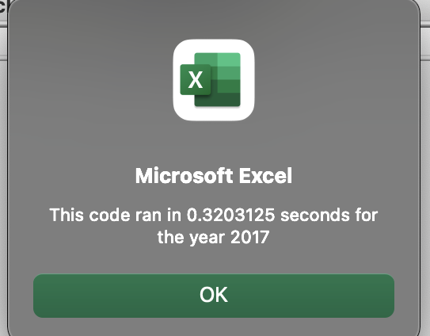
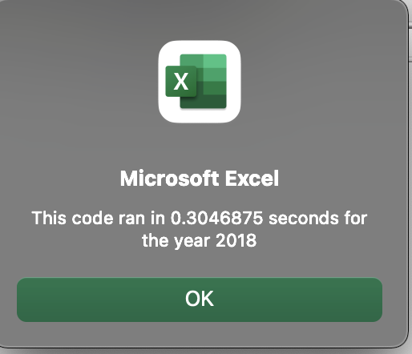
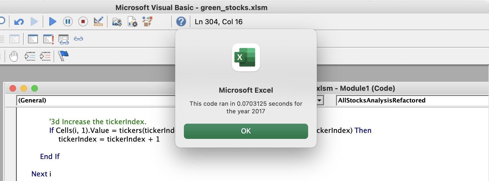
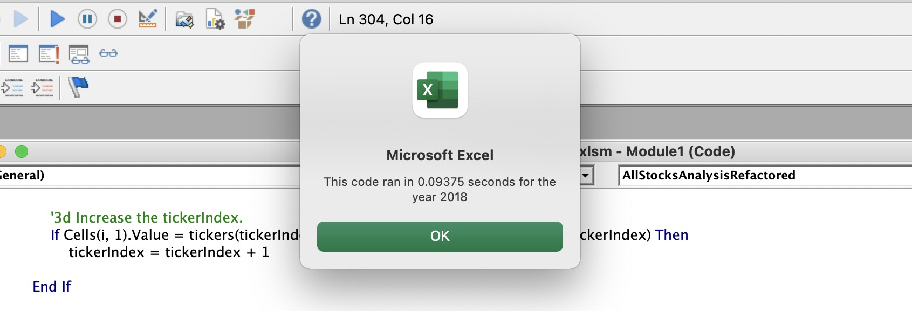

# stock-analysis
## Overview of Project: 

Steve’s parents are interested in investing in Green Energy, but they put all of their money in DAQO New Energy Corp. without doing much research. As a recent finance graduate, Steve is concerned about diversifying their funds. First, an analysis was performed on the clean energy stock data and DAQO stock data in Steve’s excel spreadsheet to find the total daily volume and percent return. 

Now, to do a little more research for his parents, he wants to expand the dataset to include the entire stock market over the last few years. Although the code works well for a dozen stocks, it does not work as well for thousands of stocks. In order for the code to run more efficiently, the original code was refactored from Module 2 to loop through all the data at one time. 

## Results: 

Before refactoring the code, I inserted the code to create the input box, chart headers, ticker array, and to activate the worksheet. The steps were then listed out in order to set the structure for the refactoring. Below is the code as written in the file. The refractored code proved to be more efficient than the original code as the refractored code ran faster for both 2017 and 2018.

The green stocks analyzed were performing much better in 2017 than 2018 as most of the percent returns were negative in 2018. The refactored code ran almost 24% faster than the original code for the All Stocks Analysis. (see refactored code and images below)

...

    Sub AllStocksAnalysisRefactored()
    Dim startTime As Single
    Dim endTime  As Single

    yearValue = InputBox("What year would you like to run the analysis on?")

    startTime = Timer
    
    'Format the output sheet on All Stocks Analysis worksheet
    Worksheets("AllStocksAnalysis").Activate
    
    Range("A1").Value = "All Stocks (" + yearValue + ")"
    
    'Create a header row
    Cells(3, 1).Value = "Ticker"
    Cells(3, 2).Value = "Total Daily Volume"
    Cells(3, 3).Value = "Return"

    'Initialize array of all tickers
    Dim tickers(12) As String
    
    tickers(0) = "AY"
    tickers(1) = "CSIQ"
    tickers(2) = "DQ"
    tickers(3) = "ENPH"
    tickers(4) = "FSLR"
    tickers(5) = "HASI"
    tickers(6) = "JKS"
    tickers(7) = "RUN"
    tickers(8) = "SEDG"
    tickers(9) = "SPWR"
    tickers(10) = "TERP"
    tickers(11) = "VSLR"
    
    'Activate data worksheet
    Worksheets(yearValue).Activate
    
    'Get the number of rows to loop over
    RowCount = Cells(Rows.Count, "A").End(xlUp).Row
    
    '1a) Create a ticker Index
    Dim tickerIndex As Single
    tickerIndex = 0

    '1b) Create three output arrays
    Dim tickerVolumes(12) As Long
    Dim tickerStartingPrices(12) As Single
    Dim tickerEndingPrices(12) As Single
    
    ''2a) Create a for loop to initialize the tickerVolumes to zero.
    For i = 0 To 11
        tickerVolumes(i) = 0
        tickerStartingPrices(i) = 0
        tickerEndingPrices(i) = 0
        
    Next i
    
        
    ''2b) Loop over all the rows in the spreadsheet.
    For i = 2 To RowCount
    
    
    
        '3a) Increase volume for current ticker
            tickerVolumes(tickerIndex) = tickerVolumes(tickerIndex) + Cells(i, 8).Value

        
        
        '3b) Check if the current row is the first row with the selected tickerIndex.
        'If  Then
        If Cells(i, 1).Value = tickers(tickerIndex) And Cells(i - 1, 1).Value <> tickers(tickerIndex) Then
            tickerStartingPrices(tickerIndex) = Cells(i, 6).Value
            
       End If
      
        
        '3c) check if the current row is the last row with the selected ticker
         'If the next row’s ticker doesn’t match, increase the tickerIndex.
    
         If Cells(i, 1).Value = tickers(tickerIndex) And Cells(i + 1, 1).Value <> tickers(tickerIndex) Then
            tickerEndingPrices(tickerIndex) = Cells(i, 6).Value
    
        End If

            
            '3d Increase the tickerIndex.
            If Cells(i, 1).Value = tickers(tickerIndex) And Cells(i + 1, 1).Value <> tickers(tickerIndex) Then
                tickerIndex = tickerIndex + 1
            
        End If
    
    Next i
    
    '4) Loop through your arrays to output the Ticker, Total Daily Volume, and Return.
    For i = 0 To 11
    
        Worksheets("AllStocksAnalysis").Activate
        tickerIndex = i
        Cells(i + 4, 1).Value = tickers(i)
        Cells(i + 4, 2).Value = tickerVolumes(i)
        Cells(i + 4, 3).Value = tickerEndingPrices(i) / tickerStartingPrices(i) - 1
        
    Next i
    
    'Formatting
    Worksheets("AllStocksAnalysis").Activate
    
    Range("A3:C3").Font.FontStyle = "Bold"
    Range("A3:C3").Borders(xlEdgeBottom).LineStyle = xlContinuous
    Range("B4:B15").NumberFormat = "#,##0"
    Range("C4:C15").NumberFormat = "0.0%"
    Columns("B").AutoFit

    dataRowStart = 4
    dataRowEnd = 15

    For i = dataRowStart To dataRowEnd
        
        If Cells(i, 3) > 0 Then
            
            Cells(i, 3).Interior.Color = vbGreen
            
        Else
        
            Cells(i, 3).Interior.Color = vbRed
            
        End If
        
    Next i
 
    endTime = Timer
    MsgBox "This code ran in " & (endTime - startTime) & " seconds for the year " & (yearValue)

    End Sub

...

## Summary:
The goal of refactoring the code is to make the code run more efficiently. Cleaner and more organized code will help the program run faster and will improve the readability for other programmers. Disadvantages of refactoring may include having applications that are too big, or not having the proper test cases for the existing codes. For this analysis, it was beneficial to refactor the code resulting in the program running alomst 24% quicker. This will allow Steve and other programers to not only read the code more efficiently and run the code faster, it will also allow for larger data sets to be analyzed using this code in the future. 
